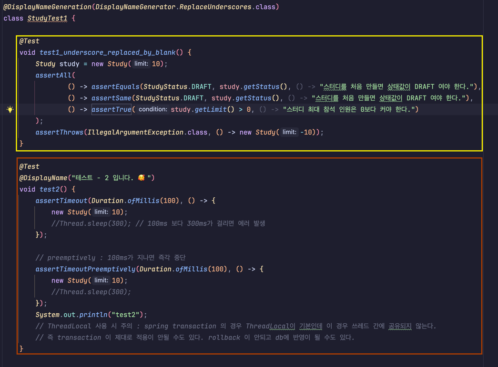

# Junit5의 Tag

### 기본 태그
```java
@Test
@DisplayName("Tagging1")
@Tag("fast")
void tagging1() {
    System.out.println("fast");
}

@Test
@DisplayName("Tagging2")
@Tag("slow")
void tagging2() {
    System.out.println("slow");
}
```

### 커스텀 태그
```java
@Target(ElementType.METHOD)
@Retention(RetentionPolicy.RUNTIME)
@Test
@Tag("fast")
public @interface FastTest {
}

```

```java
@FastTest
@DisplayName("FastTest")
void custom_tagging() {
    System.out.println("fast custom");
}

@SlowTest
@DisplayName("SlowTest")
void custom_tagging2() {
    System.out.println("slow custom");
}
```

### intellij에서 tag 설정하는 법


# Junit5의 반복하기

### 기본 반복
```java
class StudyTest {

  private final Study study = new Study(10);

  @RepeatedTest(10)
  void repeatTest1() {
    System.out.println("repeatTest");
  }

  @RepeatedTest(10)
  void repeatTest2(RepetitionInfo info) {
    System.out.println("repeatTest " + info.getCurrentRepetition() + "/" + info.getTotalRepetitions());
  }

  @DisplayName("반복 테스트")
  @RepeatedTest(value = 10, name = "{displayName}, {currentRepetition}/{totalRepetitions}")
  void repeatTest3() {
    System.out.println("repeatTest");
  }

  @ParameterizedTest(name = "{index} {displayName} message={0}")
  @DisplayName("파라미터화 테스트")
  @ValueSource(strings = {"A", "B", "C"})
  void parameterizedTest(String message) {
    System.out.println(message);
  }

}
```

# Junit5 CsvSource 사용하기
[aggregation 관련한 참고 글](https://junit.org/junit5/docs/current/user-guide/#writing-tests-parameterized-tests-argument-aggregation)
```java
@ParameterizedTest(name = "{index} {displayName} message={0}")
@ValueSource(ints = {10, 20, 40})
void parameterizedTest(@ConvertWith(StudyConverter.class) Study study) {
    System.out.println(study.getLimit());
}

static class StudyConverter extends SimpleArgumentConverter{
    @Override
    protected Object convert(Object o, Class<?> aClass) throws ArgumentConversionException {
        assertEquals(Study.class, aClass, "Can only convert to Study");
        return new Study(Integer.parseInt(o.toString()));
    }
}
```

```java
@ParameterizedTest(name = "{index} {displayName} message={0}")
@CsvSource({"10, '자바 스터디'", "20, 스프링"})
void parameterizedTest2(ArgumentsAccessor argumentsAccessor) {
    Study study = new Study(argumentsAccessor.getInteger(0), argumentsAccessor.getString(1));
    System.out.println(study);
}
```

```java
@ParameterizedTest(name = "{index} {displayName} message={0}")
@CsvSource({"10, '자바 스터디'", "20, 스프링"})
void parameterizedTest3(@AggregateWith(StudyAggregator.class) Study study) {
    System.out.println(study);
}

static class StudyAggregator implements ArgumentsAggregator {
    @Override
    public Object aggregateArguments(ArgumentsAccessor argumentsAccessor, ParameterContext parameterContext) throws ArgumentsAggregationException {
        return new Study(argumentsAccessor.getInteger(0), argumentsAccessor.getString(1));
    }
}
```

# Junit5의 테스트 인스턴스 
테스트를 실행하려면 테스트 클래스의 인스턴스를 만들어야 합니다.
**Junit5에서는 기본적으로 테스트 메소드마다 테스트 인스턴스를 새로 만듭니다.**
아래의 그림 속 두가지 클래스는 가각 다른 인스턴스를 생성하게 됩니다.


### 왜 테스트마다 인스턴스를 새로 만들었을까?
테스트 간의 의존성을 줄이기 위해

# Junit5의 테스트 간의 의존성
테스트 코드를 선언한 순서대로 실행하는 것처럼 보이지만 실제로는 그렇지 않습니다.
테스트 간의 의존성을 줄이기 위해 테스트 메소드의 실행 순서를 보장하지 않음.

