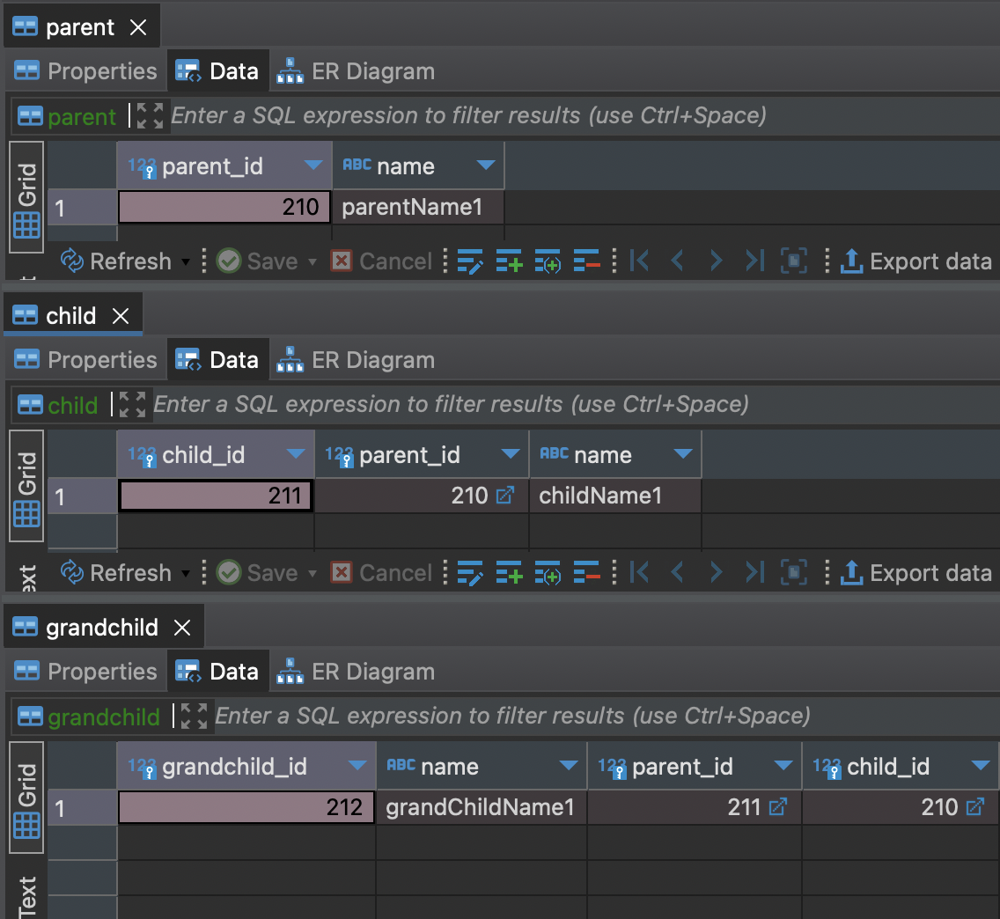
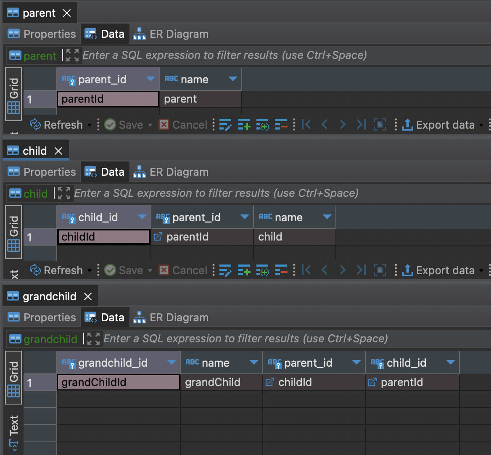

# 식별 관계와 복합 키 매핑

### 식별 관계

부모의 PK를 받아 FK이자 PK로 사용합니다.

~~단점이 너무 많아요오....~~

- 장점
  - 복합키이므로 모든 PK들이 PK 인덱스를 활용 할 수 있습니다.
  - 상위 테이블의 PK를 자손들이 가지고 있으므로 때로 JOIN 없이도 데이터 조회가 가능합니다.
- 단점
  - 상위 테이블의 PK가 점점 자손에게 전파 되면서 복합키 크기가 커집니다.
  - PK로 비즈니스 의미가 있는 자연 키 컬럼을 조합하는 경우 이 PK의 변경이 힘들어집니다.
  - 복합키를 사용하기 위해 복합키 클래스를 관리하기 힘듭니다.

### 비식별 관계

부모의 PK가 FK의 역할만 합니다.

자손 테이블은 PK에 비즈니스와 관련 없는 대리키를 사용하는 경우가 대부분입니다.

1. **필수** : 자식의 FK에 NULL이 올 수 없습니다. 부모가 무조건 있어야 합니다.
2. **선택** : 자식의 FK에 NULL이 와도 됩니다. 부모가 있어도 되고 없어도 됩니다.

## 복합 키 : 비식별 관계

단일 키일때는 보통 자바의 기본 타입을 사용하지만 **복합키일 땐 별도의 식별자 클래스를 만들고 `Serializable` 을 구현해야 합니다.**

왜냐하면 JPA는 영속성 컨텍스트에 엔티티를 보관할 때 엔티티의 식별자를 키로 사용하는데 이 식별자를 구분하기 위해 `equals` 와 `hashCode` 를 사용해 동등성 비교를 합니다.


### @IdClass를 사용한 비식별 복합 키

```java
@Entity
@IdClass(ParentId.class)
public class Parent {
    @Id
    @Column(name = "PARENT_ID1")
    private String id1;
    @Id
    @Column(name = "PARENT_ID2")
    private String id2;
    private String name;
}

public class ParentId implements Serializable {
    private String id1;
    private String id2;

    public ParentId() {
    }
		//getter&setter
		//equals&hashCode
}
```

```java
@Entity
public class Child{
    @Id @GeneratedValue
    @Column(name = "CHILD_ID")
    private Long id;

    @ManyToOne
    @JoinColumns({
            @JoinColumn(name = "PARENT_ID1", referencedColumnName = "PARENT_ID1"),
            @JoinColumn(name = "PARENT_ID2", referencedColumnName = "PARENT_ID2")
    })
    private Parent parent;

    private String name;
}
```


### @EmbeddedId를 이용한 비식별 복합 키

```java
@Entity
public class Parent {
    @EmbeddedId
    private ParentId id;
    private String name;
}

@Embeddable
public class ParentId implements Serializable {
    @Column(name = "PARENT_ID1")
    private String id1;
    @Column(name = "PARENT_ID2")
    private String id2;

    public ParentId() {
    }
		//getter&setter
		//equals&hashCode
}
```

```java
Parent parent = new Parent();
ParentId parentId = new ParentId();
parentId.setId1("myId1");
parentId.setId2("myId2");
parent.setId(parentId);
```

## 복합 키 : 식별 관계



### @IdClass를 이용한 식별 복합 키

- `parent` 의 ID를  `**@Id` 를 이용해 PK로 매핑**하고 `**@ManyToOne` 을 이용해 연관관계(FK) 매핑**을 합니다.
- `child` 의 복합키 클래스는 둘 다 String으로 id를 매핑하면 되지만
  `**grand_child` 의 복합키 클래스는 하나는 `child` 의 복합키 클래스를 받아야 합니다.**

```java
@Entity
public class Parent {
    ***@Id @Column(name = "PARENT_ID")
    private String id;***
    private String name;
}

@Entity
@IdClass(ChildId.class)
public class Child {
    ***@Id
    @ManyToOne
    @JoinColumn(name = "PARENT_ID")
    private Parent parent;***

    @Id @Column(name = "CHILD_ID")
    private String childId;

    private String name;
}

@Entity
@IdClass(GrandChildId.class)
public class GrandChild {
    ***@Id
    @ManyToOne
    @JoinColumns({
        @JoinColumn(name = "PARENT_ID"),
        @JoinColumn(name = "CHILD_ID")
    })
    private Child child;***

    @Id @Column(name = "GRANDCHILD_ID")
    private String grandChildId;

    private String name;
}
```

```java
public class ChildId implements Serializable {
    private String parent;
    private String childId;
}

public class GrandChildId implements Serializable {
    ***private ChildId child;***
    private String grandChildId;
}
```

```java
// 부모 생성
Parent parent = new Parent();
parent.setName("parentName1");
em.persist(parent);

// 자식 생성
Child child = new Child();
child.setName("childName1");
child.setParent(parent);
em.persist(child);

// 손주 생성
GrandChild grandChild = new GrandChild();
grandChild.setName("grandChildName1");
grandChild.setChild(child);
em.persist(grandChild);
tx.commit();
em.clear();

// 부모 조회
Parent findParent = em.find(Parent.class, parent.getId());

// 자식 조회
ChildId childId = new ChildId();
childId.setParent(findParent.getId());
childId.setChildId(child.getChildId());
Child findChild = em.find(Child.class, childId);

// 손주 조회
GrandChildId grandChildId = new GrandChildId();
grandChildId.setChild(childId);
grandChildId.setGrandChildId(grandChild.getGrandChildId());
GrandChild findGrandChild = em.find(GrandChild.class, grandChildId);
```

- query log

    ```java
    Hibernate: 
        select
            grandchild0_.PARENT_ID as parent_i0_1_0_,
            grandchild0_.CHILD_ID as child_id0_1_0_,
            grandchild0_.GRANDCHILD_ID as grandchi1_1_0_,
            grandchild0_.PARENT_ID as parent_i3_1_0_,
            grandchild0_.CHILD_ID as child_id4_1_0_,
            grandchild0_.name as name2_1_0_,
            child1_.CHILD_ID as child_id1_0_1_,
            child1_.PARENT_ID as parent_i2_0_1_,
            child1_.name as name3_0_1_,
            parent2_.PARENT_ID as parent_i1_2_2_,
            parent2_.name as name2_2_2_ 
        **from
            GrandChild grandchild0_ 
        inner join
            Child child1_ 
                on grandchild0_.PARENT_ID=child1_.CHILD_ID 
                and grandchild0_.CHILD_ID=child1_.PARENT_ID 
        inner join
            Parent parent2_ 
                on child1_.PARENT_ID=parent2_.PARENT_ID 
        where
            grandchild0_.PARENT_ID=?
            and grandchild0_.CHILD_ID=? 
            and grandchild0_.GRANDCHILD_ID=?**
    ```




### @EmbeddedId를 이용한 식별 복합 키

- `@EmbeddedId`를 이용할 경우 `@GeneratedValue` 가 안됩니다.
- `**@MapsId` 를 이용해서 해당 키를 FK로도 쓰고 PK에도 매핑합니다.**

```java
@Entity
public class Parent {
    @Id
    @Column(name = "PARENT_ID")
    private String id;
    private String name;
}

@Entity
public class Child {
    @EmbeddedId
    private ChildId id;
    **@MapsId("parentId")
    @ManyToOne
    @JoinColumn(name = "PARENT_ID")
    private Parent parent; //ChildId 클래스의 parentId에 매핑**
    private String name;
}

@Entity
public class GrandChild {
    @EmbeddedId
    private GrandChildId id;

    **@MapsId("childId")
    @ManyToOne
    @JoinColumns({
        @JoinColumn(name = "PARENT_ID"),
        @JoinColumn(name = "CHILD_ID")
    })
    private Child child; //GrandChildId 클래스의 childId에 매핑**

    private String name;
}
```

```java
@Embeddable
public class ChildId implements Serializable {
    @Column(name = "CHILD_ID")
    private String childId;
    **private String parentId; //@MapsId로 매핑된 키**
		//noArgsConstructor
		//getter&setter
		//equals&hashCode
}

@Embeddable
public class GrandChildId implements Serializable {
    @Column(name = "GRANDCHILD_ID")
    private String grandChildId;
    **private ChildId childId; //@MapsId로 매핑된 키**
		//noArgsConstructor
		//getter&setter
		//equals&hashCode
}
```

```java
// 부모 생성
Parent parent = new Parent();
parent.setId("parentId");
parent.setName("parent");
em.persist(parent);

// 자식 생성
Child child = new Child();
child.setId(new ChildId(parent.getId(), "childId"));
child.setName("child");
child.setParent(parent);
em.persist(child);

// 손주 생성
GrandChild grandChild = new GrandChild();
grandChild.setId(new GrandChildId(child.getId(), "grandChildId"));
grandChild.setName("grandChild");
grandChild.setChild(child);
em.persist(grandChild);

tx.commit();
em.clear();

// 부모 조회
Parent findParent = em.find(Parent.class, parent.getId());
// 자식 조회
Child child1 = em.find(Child.class, child.getId());
// 손주 조회
GrandChild grandChild1 = em.find(GrandChild.class, grandChild.getId());
```

- query log

    ```java
    select
            grandchild0_.PARENT_ID as parent_i0_1_0_,
            grandchild0_.CHILD_ID as child_id0_1_0_,
            grandchild0_.GRANDCHILD_ID as grandchi1_1_0_,
            grandchild0_.PARENT_ID as parent_i3_1_0_,
            grandchild0_.CHILD_ID as child_id4_1_0_,
            grandchild0_.name as name2_1_0_,
            child1_.CHILD_ID as child_id1_0_1_,
            child1_.PARENT_ID as parent_i2_0_1_,
            child1_.name as name3_0_1_,
            parent2_.PARENT_ID as parent_i1_2_2_,
            parent2_.name as name2_2_2_ 
        **from
            GrandChild grandchild0_ 
        inner join
            Child child1_ 
                on grandchild0_.PARENT_ID=child1_.CHILD_ID 
                and grandchild0_.CHILD_ID=child1_.PARENT_ID 
        inner join
            Parent parent2_ 
                on child1_.PARENT_ID=parent2_.PARENT_ID 
        where
            grandchild0_.PARENT_ID=? 
            and grandchild0_.CHILD_ID=? 
            and grandchild0_.GRANDCHILD_ID=?**
    ```


### 단일 키 : 식별 관계

**부모와 자손이 일대일 관계**일때 부모의 PK가 자손의 PK가 되는 단일 키 식별관계를 만들 수 있습니다.


```java
@Entity
public class Board {
    @Id @GeneratedValue
    @Column(name = "BOARD_ID")
    private Long id;
    private String title;

    **@OneToOne(mappedBy = "board")
    private BoardDetail boardDetail;**

		//getter&setter
}

@Entity
public class BoardDetail {
    **@Id
    private Long boardId;

    *@MapsId*
    @OneToOne
    @JoinColumn(name = "BOARD_ID")
    private Board board;**

    private String content;
		
		//getter&setter
}
```

```java
//게시글 등록
Board board = new Board();
board.setTitle("board1");
em.persist(board);

//게시글 작성
BoardDetail boardDetail = new BoardDetail();
boardDetail.setContent("board1 - content1");
boardDetail.setBoard(board);
em.persist(boardDetail);

tx.commit();
em.clear();

//게시글 찾기
Board findBoard = em.find(Board.class, board.getId());
//게시글 작성 내용 찾기
BoardDetail findBoardDetail = em.find(BoardDetail.class, ***board.getId()***);
```

- query log
```text
Hibernate: 
    select
        board0_.BOARD_ID as board_id1_0_0_,
        board0_.title as title2_0_0_,
        boarddetai1_.BOARD_ID as board_id1_1_1_,
        boarddetai1_.content as content2_1_1_ 
    from
        Board board0_ 
    left outer join
        BoardDetail boarddetai1_ 
            on board0_.BOARD_ID=boarddetai1_.BOARD_ID 
    where
        board0_.BOARD_ID=?
```

