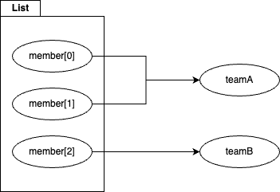
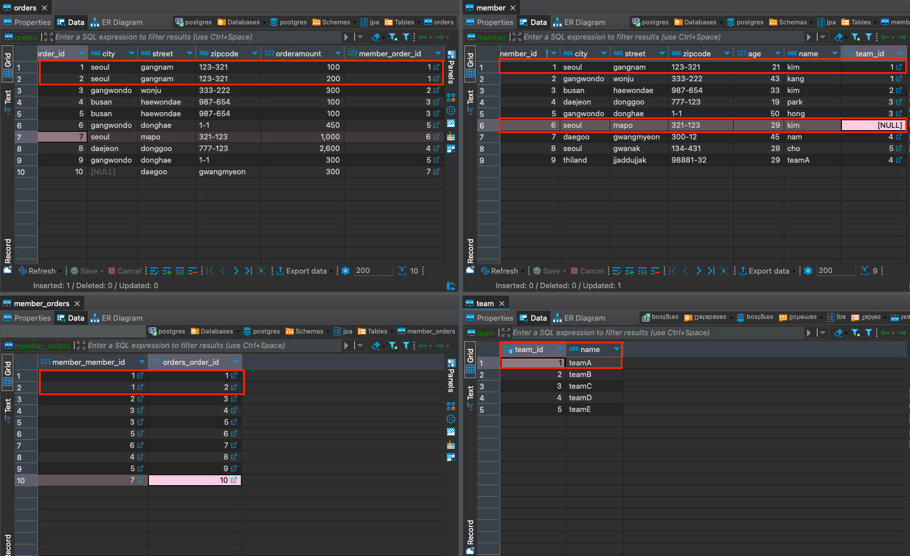

# JPQL 조인
JPQL 조인은 연관 필드를 사용합니다.
아래처럼 `Member m`의 조인으로 `m.team`이라는 본인의 필드를 사용해 조인합니다.
`Member m JOIN m.team t`

### 내부조인
`JOIN` 에 아무것도 붙이지 않으면 자연스럽게 내부조인이 됩니다.

< 코드 >
```java
String query = "SELECT m.name, t.name FROM Member m JOIN m.team t WHERE t.name = :name";
List<Object[]> resultList = em.createQuery(query).setParameter("name", "teamA").getResultList();
```

< 결과 >
```text
select
        member0_.name as col_0_0_,
        team1_.name as col_1_0_  
    from
        Member member0_ 
    inner join Team team1_ on member0_.TEAM_ID=team1_.TEAM_ID 
    where
        team1_.name=?
```

### 외부조인
`LEFT JOIN`, `LEFT OUTER JOIN` 을 사용하면 외부조인이 됩니다.
`OUTER`는 생략 가능합니다.

< 코드 >
```java
String query = "SELECT m.name, t.name FROM Member m LEFT OUTER JOIN m.team t WHERE m.name = :name";
List<Object[]> resultList = em.createQuery(query).setParameter("name", "kim").getResultList();

resultList.forEach(o -> {
  System.out.println("--------------------");
  System.out.println("member name | " + o[0]);
  System.out.println("team name | " + o[1]);
  System.out.println("--------------------");
});
```

< 결과 >
```text
Hibernate: 
    select
        member0_.name as col_0_0_,
        team1_.name as col_1_0_ 
    from
        Member member0_ 
    left outer join
        Team team1_ 
            on member0_.TEAM_ID=team1_.TEAM_ID 
    where
        member0_.name=?
--------------------
member name | kim
team name | teamB
--------------------
--------------------
member name | kim
team name | null
--------------------
```

### 컬렉션 조인
일대다, 다대다 관계처럼 컬렉션을 사용하는 곳에 조인하는 것을 컬렉션 조인이라고 합니다. 
그냥 일반 조인처럼 사용하면 됩니다.
```java
String query = "SELECT t, m FROM Team t JOIN t.members m WHERE t.name = :name";
```

### 세타 조인
**연관관계가 아닌 필드를 이용해 조인**을 할 수 있습니다.
이땐 `WHERE` 절을 이용해 조인합니다.

< 코드 >
```java
String query = "SELECT m.team, m.id, m.name, t.name FROM Member m, Team t WHERE m.name = t.name";

List<Object[]> resultList = em.createQuery(query).getResultList();

resultList.forEach(o -> {
  Team team = (Team) o[0];
  System.out.println("--------------------");
  System.out.println("member id: " + o[1]);
  System.out.println("member name: " + o[2]);
  System.out.println("member's team name: " + team.getName());
  System.out.println("joined team name: " + o[3]);
  System.out.println("--------------------");
});
```

< 결과 >
```text
Hibernate: 
    select
        member0_.TEAM_ID as col_0_0_,
        member0_.MEMBER_ID as col_1_0_,
        member0_.name as col_2_0_,
        team1_.name as col_3_0_,
        team2_.TEAM_ID as team_id1_4_,
        team2_.name as name2_4_ 
    from
        Member member0_ cross 
    join
        Team team1_ 
    inner join
        Team team2_ 
            on member0_.TEAM_ID=team2_.TEAM_ID 
    where
        member0_.name=team1_.name
--------------------
member id: 9
member name: teamA
member's team name: teamD
joined team name: teamA
--------------------
```

### JOIN ON
**ON 절을 이용해 조인**을 할 수 있습니다.
```java
String query = "SELECT m.name, t.name FROM Member m JOIN m.team t ON t.name = :name";
```

### fetch 조인
JPQL에서 성능 최적화를 위해 제공하는 기능입니다.
연관된 엔티티를 한 번에 조회하는 기능입니다.

`Member`의 `Team`을 지연로딩 설정을 해도 `fetch join`을 사용하면 `Member` 조회시 `Team`을 함께 조회합니다.
프록시가 아닌 실제 엔티티라서 `Member`가 준영속 상태로 분리 되어도 `Team`을 사용할 수 있습니다.



< 코드 >
```java
String query = "SELECT m FROM Member m JOIN FETCH m.team";
```
< 결과 >
```text
Hibernate: 
    select
        team0_.TEAM_ID as team_id1_4_0_,
        members1_.MEMBER_ID as member_i1_0_1_,
        team0_.name as name2_4_0_,
        members1_.city as city2_0_1_,
        members1_.street as street3_0_1_,
        members1_.zipcode as zipcode4_0_1_,
        members1_.age as age5_0_1_,
        members1_.name as name6_0_1_,
        members1_.TEAM_ID as team_id7_0_1_ 
    from
        Team team0_ 
    inner join
        Member members1_ 
            on team0_.TEAM_ID=members1_.TEAM_ID 
    where
        team0_.name=?
```

### 컬렉션 fetch 조인
`Team`을 조회하면 해당된 `Member`들을 함께 조회합니다.


< 코드 >
`TeamA`는 하나밖에 없지만 `TeamA` 에 속한 `Member`가 둘이기 때문에 resultList에 `TeamA`가 둘입니다. 
```java
String query = "SELECT t FROM Team t JOIN FETCH t.members WHERE t.name in (:names)";

List<Team> resultList = em.createQuery(query, Team.class).setParameter("names", List.of("teamA", "teamB") ).getResultList();

resultList.forEach(t -> {
  System.out.println("--------------------");
  System.out.println("team name: " + t.getName());
  List<Member> members = t.getMembers();
  members.forEach(m -> {
    System.out.println("member name: " + m.getName());
  });
  System.out.println("--------------------");
});
```
< 결과 >
```text
Hibernate: 
    select
        team0_.TEAM_ID as team_id1_4_0_,
        members1_.MEMBER_ID as member_i1_0_1_,
        team0_.name as name2_4_0_,
        members1_.city as city2_0_1_,
        members1_.street as street3_0_1_,
        members1_.zipcode as zipcode4_0_1_,
        members1_.age as age5_0_1_,
        members1_.name as name6_0_1_,
        members1_.TEAM_ID as team_id7_0_1_,
        members1_.TEAM_ID as team_id7_0_0__,
        members1_.MEMBER_ID as member_i1_0_0__ 
    from
        Team team0_ 
    inner join
        Member members1_ 
            on team0_.TEAM_ID=members1_.TEAM_ID 
    where
        team0_.name in (
            ? , ?
        )
--------------------
team name: teamA
member name: hong
member name: kang
--------------------
--------------------
team name: teamA
member name: hong
member name: kang
--------------------
--------------------
team name: teamB
member name: kim
--------------------
```

### 페치 조이놔 DISTINCT
위 코드에선 `TeamA`가 중복되어 나타났습니다.
`DISTINCT`를 사용하면 중복을 제거할 수 있습니다.
```text
String query = "SELECT DISTINCT t FROM Team t JOIN FETCH t.members WHERE t.name in (:names)";
```

### 페치조인과 일반조인의 차이 -1

일반조인은 `SELECT`절에 조회를 요청한 엔티티만 조회하고 요청되지 않은 엔티티는 조회하지 않습니다.
페치조인은 `JOIN`절에 사용된 엔티티를 함께 조회합니다.

- 일반조인
```java
  String commonQuery = "SELECT t FROM Team t JOIN t.members m WHERE t.name in (:names)";
  List<Team> commonResult = em.createQuery(commonQuery, Team.class)
  .setParameter("names", "teamA")
  .getResultList();
```
```text
Hibernate: 
    select
        team0_.TEAM_ID as team_id1_4_,
        team0_.name as name2_4_ 
    from
        Team team0_ 
    inner join
        Member members1_ 
            on team0_.TEAM_ID=members1_.TEAM_ID 
    where
        team0_.name in (
            ?
        )
```
- 페치조인
```java
String fetchQuery = "SELECT t FROM Team t JOIN FETCH t.members WHERE t.name in (:names)";

List<Team> fetchResult = em.createQuery(fetchQuery, Team.class)
        .setParameter("names", "teamA")
        .getResultList();
```
```text
Hibernate: 
    select
        team0_.TEAM_ID as team_id1_4_0_,
        members1_.MEMBER_ID as member_i1_0_1_,
        team0_.name as name2_4_0_,
        members1_.city as city2_0_1_,
        members1_.street as street3_0_1_,
        members1_.zipcode as zipcode4_0_1_,
        members1_.age as age5_0_1_,
        members1_.name as name6_0_1_,
        members1_.TEAM_ID as team_id7_0_1_,
        members1_.TEAM_ID as team_id7_0_0__,
        members1_.MEMBER_ID as member_i1_0_0__ 
    from
        Team team0_ 
    inner join
        Member members1_ 
            on team0_.TEAM_ID=members1_.TEAM_ID 
    where
        team0_.name in (
            ?
        )
```

### 페치조인과 일반조인의 차이 -2
만약 일반조인에 `즉시로딩`을 설정한다면 `FETCH JOIN`과 다르게 조인이 되는것이 아니고 `SELECT`가 **2번** 날아갑니다.
```text
Hibernate: 
    select
        team0_.TEAM_ID as team_id1_4_,
        team0_.name as name2_4_ 
    from
        Team team0_ 
    inner join
        Member members1_ 
            on team0_.TEAM_ID=members1_.TEAM_ID 
    where
        team0_.name in (
            ?
        )
Hibernate: 
    select
        members0_.TEAM_ID as team_id7_0_0_,
        members0_.MEMBER_ID as member_i1_0_0_,
        members0_.MEMBER_ID as member_i1_0_1_,
        members0_.city as city2_0_1_,
        members0_.street as street3_0_1_,
        members0_.zipcode as zipcode4_0_1_,
        members0_.age as age5_0_1_,
        members0_.name as name6_0_1_,
        members0_.TEAM_ID as team_id7_0_1_ 
    from
        Member members0_ 
    where
        members0_.TEAM_ID=?
```

### 페치조인의 특징과 한계
- SQL 한번으로 연관된 엔티티를 함께 조회할 수 있어서 `SQL` 조회를 줄일 수 있습니다.
- 글로벌 로딩전략보다 페치조인이 우선시 됩니다.
  - `@OneToMany(mappedBy = "team", fetch = FetchType.LAZY)` 엔티티에 직접 설정하는 로딩전략을 `글로벌 로딩전략` 이라고 합니다.
  - 모든 엔티티들의 글로벌 로딩전략을 `즉시로딩`으로 하는 것은 사용하지 않는 엔티티를 매번 로딩하는 것이므로 성능에 좋지 않고 필요할 때 `페치조인`을 사용하는 것이 좋습니다.
- 페치조인한 엔티티는 별칭을 줄 수 없습니다.
  - 하이버네이트 기준으론 페치조인한 엔티티에 별칭을 주지 못해서 쿼리문에서 다시 사용하는 것이 불가능합니다.
  - 하이버네이트를 구현한 다른 구현체들은 별칭을 주는것을 허용하기도 합니다. 사용시 주의해야합니다.
- 둘 이상의 컬렉션을 패치할 수 없다.
  - `Caused by: org.hibernate.loader.MultipleBagFetchException: cannot simultaneously fetch multiple bags`
- 컬렉션을 페치조인하면 페이징을 사용할 수 없습니다.

### 페치조인한 엔티티에 별칭을 줄 수 있다.
이렇게 사용이 꼭 하고 싶다면 `Member`를 기준으로 조회한 후 `Team`이름에 조건을 거는 것이 맞는듯 싶다.
< 코드 >
```java
String query = "SELECT t FROM Team t JOIN FETCH t.members m WHERE t.name = :names AND m.name = :memberName";
List<Team> resultList = em.createQuery(query, Team.class)
        .setParameter("names", "teamA")
        .setParameter("memberName", "hong")
        .getResultList();

resultList.forEach(t -> {
    System.out.println("--------------------");
    System.out.println("team name: " + t.getName());
    for (Member member : t.getMembers()) {
        System.out.println("member name: " + member.getName());
    }
});
```
< 결과 >
```text
Hibernate: 
    select
        team0_.TEAM_ID as team_id1_4_0_,
        members1_.MEMBER_ID as member_i1_0_1_,
        team0_.name as name2_4_0_,
        members1_.city as city2_0_1_,
        members1_.street as street3_0_1_,
        members1_.zipcode as zipcode4_0_1_,
        members1_.age as age5_0_1_,
        members1_.name as name6_0_1_,
        members1_.TEAM_ID as team_id7_0_1_,
        members1_.TEAM_ID as team_id7_0_0__,
        members1_.MEMBER_ID as member_i1_0_0__ 
    from
        Team team0_ 
    inner join
        Member members1_ 
            on team0_.TEAM_ID=members1_.TEAM_ID 
    where
        team0_.name=? 
        and members1_.name=?
--------------------
team name: teamA
member name: hong
```

### 둘 이상의 컬렉션을 패치할 수 없다.
아예 아래와 같은 에러가 나서 시도할 수도 없습니다.
```java
@Entity
public class Member {
    @Id
    @GeneratedValue
    @Column(name = "MEMBER_ID")
    private Long id;
    private String name;
    private int age;
    @Embedded
    private Address address;
    @ManyToOne(fetch = FetchType.LAZY)
    @JoinColumn(name = "TEAM_ID")
    private Team team;

    @OneToMany
    @JoinColumn(name = "MEMBER_ORDER_ID")
    private List<Order> orders = new ArrayList<Order>();

    @OneToMany
    @JoinColumn(name = "MEMBER_PRODUCT_ID")
    private List<Product> products = new ArrayList<Product>();
}

// -----
  
String sql = "SELECT m FROM Member m JOIN FETCH m.orders o JOIN FETCH m.products p WHERE m.name = :name";

List<Member> resultList = em.createQuery(sql, Member.class)
        .setParameter("name", "hong")
        .getResultList();
```
```text
Caused by: org.hibernate.loader.MultipleBagFetchException: cannot simultaneously fetch multiple bags: [org.example.ch10.jpql.entity.Member.orders, org.example.ch10.jpql.entity.Member.products]
```

### 컬렉션을 페치조인하면 페이징을 사용할 수 없습니다.
아래와 같은 경고 메세지를 띄우지만 사용할 수 있습니다.
하지만 메모리에서 페이징 처리를 합니다.
데이터가 많으면 성능 이슈와 메모리 초과 에러가 날 수 있습니다.

```java
public class PagingCannotUse {
    public static void main(String[] args) {
        EntityManagerFactory emf = Persistence.createEntityManagerFactory("myApp");
        EntityManager em = emf.createEntityManager();

        String query = "SELECT m FROM Member m JOIN FETCH m.orders";

        List<Member> resultList = em.createQuery(query, Member.class)
                .setFirstResult(0)
                .setMaxResults(5)
                .getResultList();

        System.out.println(resultList.size());
        for (Member member : resultList) {
            System.out.println("member name: " + member.getName());
            List<Order> orders = member.getOrders();
            for (Order order : orders) {
                System.out.println("order id: " + order.getId());
            }
        }

    }
}
```
```text
WARN: HHH000104: firstResult/maxResults specified with collection fetch; applying in memory!

Hibernate: 
    select
        member0_.MEMBER_ID as member_i1_0_0_,
        orders1_.ORDER_ID as order_id1_1_1_,
        member0_.city as city2_0_0_,
        member0_.street as street3_0_0_,
        member0_.zipcode as zipcode4_0_0_,
        member0_.age as age5_0_0_,
        member0_.name as name6_0_0_,
        member0_.TEAM_ID as team_id7_0_0_,
        orders1_.city as city2_1_1_,
        orders1_.street as street3_1_1_,
        orders1_.zipcode as zipcode4_1_1_,
        orders1_.orderAmount as orderamo5_1_1_,
        orders1_.MEMBER_ORDER_ID as member_o6_1_0__,
        orders1_.ORDER_ID as order_id1_1_0__ 
    from
        Member member0_ 
    inner join
        ORDERS orders1_ 
            on member0_.MEMBER_ID=orders1_.MEMBER_ORDER_ID
5
member name: hong
order id: 1
order id: 2
member name: kang
order id: 3
member name: kim
order id: 4
order id: 5
member name: hong
order id: 6
order id: 9
member name: kim
order id: 7
```

### 경로 표현식
`.` 을 찍어 객체 그래프를 탐색하는 것
- 상태 필드(state field): 단순히 값을 저장하기 위한 필드
  - 더이상 탐색할 수 없습니다.
  - ex) m.name, m.age
- 단일 값 연관 필드(single-valued association field): 연관된 엔티티가 하나인 경우
  - 내부조인이 묵시적으로 됩니다. **더 탐색할 수 있습니다.**
  - ex) m.team
- 연관 필드(association field): 연관관계를 위한 필드
  - 내부조인이 묵시적으로 되지만 **더이상 탐색은 불가능합니다.** 조인을 통해 별칭을 얻어야 합니다.
  - ex) m.orders, m.products
```java
@Entity
public class Member {
    @Id
    @GeneratedValue
    @Column(name = "MEMBER_ID")
    private Long id;
    private String name;
    private int age;
    @Embedded
    private Address address;
    @ManyToOne(fetch = FetchType.LAZY)
    @JoinColumn(name = "TEAM_ID")
    private Team team;

    @OneToMany
    @JoinColumn(name = "MEMBER_ORDER_ID")
    private List<Order> orders = new ArrayList<Order>();

    @OneToMany
    @JoinColumn(name = "MEMBER_PRODUCT_ID")
    private List<Product> products = new ArrayList<Product>();
}
```
### 단일 값 연관 필드
```java
public class SingleValue {
    public static void main(String[] args) {
        EntityManagerFactory emf = Persistence.createEntityManagerFactory("myApp");
        EntityManager em = emf.createEntityManager();

        String query = "SELECT m.orders FROM Member m";

        List<Object> resultList = em.createQuery(query, Object.class).getResultList();

        resultList.forEach(o -> {
            Order order = (Order) o;
            System.out.println("order id: " + order.getId());
        });

    }
}
```
```text
Hibernate: 
    select
        orders1_.ORDER_ID as order_id1_1_,
        orders1_.city as city2_1_,
        orders1_.street as street3_1_,
        orders1_.zipcode as zipcode4_1_,
        orders1_.orderAmount as orderamo5_1_ 
    from
        Member member0_ 
    inner join
        ORDERS orders1_ 
            on member0_.MEMBER_ID=orders1_.MEMBER_ORDER_ID
```
- `member.address.city` 와 같은 embedded 타입의 필드도 단일 값 연관 필드로 볼 수 있습니다. 하지만 `Member` 테이블에 이미 속해있어서 조인은 일어나지 않습니다.
- `m.team.name`은 연관 필드이므로 조인이 일어나야 합니다.
- 그러므로 아래와 같은 쿼리는 총 3개의 테이블이 조인이 됩니다. `Member`, `Team`, `Order`

```java
public class SingleValue {
    public static void main(String[] args) {
        EntityManagerFactory emf = Persistence.createEntityManagerFactory("myApp");
        EntityManager em = emf.createEntityManager();

        String query = "SELECT m.orders FROM Member m where m.name = 'kim' and m.address.city = 'seoul' and m.team.name = 'teamA'";

        List<Object> resultList = em.createQuery(query, Object.class).getResultList();

        resultList.forEach(o -> {
            Order order = (Order) o;
            System.out.println("order id: " + order.getId());
        });

    }
}
```
```text
Hibernate: 
    select
        orders1_.ORDER_ID as order_id1_1_,
        orders1_.city as city2_1_,
        orders1_.street as street3_1_,
        orders1_.zipcode as zipcode4_1_,
        orders1_.orderAmount as orderamo5_1_ 
    from
        Member member0_ 
    inner join
        ORDERS orders1_ 
            on member0_.MEMBER_ID=orders1_.MEMBER_ORDER_ID cross 
    join
        Team team2_ 
    where
        member0_.TEAM_ID=team2_.TEAM_ID 
        and member0_.name='kim' 
        and member0_.city='seoul' 
        and team2_.name='teamA'
order id: 1
order id: 2
```
### 컬렉션 값 연관 필드
- 컬렉션 엔티티에 꼭 별칭을 줘야 합니다.
- 컬렉션은 경로 탐색의 끝입니다. **꼭 별칭을 통해 명시적 조인을 해야 합니다.**
```java
public class CollectionAssociationValue {
    public static void main(String[] args) {
        EntityManagerFactory emf = Persistence.createEntityManagerFactory("myApp");
        EntityManager em = emf.createEntityManager();

        String sql = "SELECT m.name FROM Team t join t.members m WHERE t.name = 'teamA'";

        em.createQuery(sql, String.class).getResultList().forEach(System.out::println);
    }
}
```
```text
Hibernate: 
    select
        members1_.name as col_0_0_ 
    from
        Team team0_ 
    inner join
        Member members1_ 
            on team0_.TEAM_ID=members1_.TEAM_ID 
    where
        team0_.name='teamA'
kang
kim
```

### 서브쿼리

- `EXIST`
```java
private static void exists(EntityManager em) {
        String query = "SELECT m FROM Member m WHERE EXISTS (SELECT t FROM m.team t WHERE t.name = 'teamA')";
        List<Member> resultList = em.createQuery(query, Member.class).getResultList();
        resultList.forEach(member -> {
            System.out.println("member name: " + member.getName());
        });
    }
```