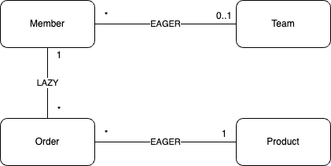

# 즉시로딩과 지연로딩

연관된 엔티티를 모두 영속성 컨텍스트에 올려두는 것, 필요할 때마다 sql을 실행 하는 것

둘 다 최적화에 좋은 방법은 아니고 애플리케이션 환경에 따라 결정해야 합니다.

### 즉시로딩 (EAGER)

엔티티를 조회할 때 연관된 엔티티도 함께 조회한다.

JPA는 DB 연결에 사용되는 비용 절감을 위해 `join 전략` 을 사용해 2개의 엔티티를 동시에 조회합니다.

`Team` 이 없을 경우를 고려해 JPA는 `left outer join` 을 사용 했습니다.

하지만 없는 데이터를 `null` 로 가져오는 것보다 있는 것만 조회하는 내부조인이 성능상 더 유리하므로 `null` 이 들어가지 않는 테이블은 꼭 `@JoinColumn( name="TEAM_ID", nullable = false )` 이렇게 명시 해주는 것이 좋습니다.

```java
Member cho = em.find(Member.class, "cho");
System.out.println("cho's name : " + cho.getUsername());

----- nullable -----

Hibernate: 
    select
        member0_.MEMBER_ID as member_i1_0_0_,
        member0_.TEAM_ID as team_id3_0_0_,
        member0_.username as username2_0_0_,
        team1_.TEAM_ID as team_id1_1_1_,
        team1_.name as name2_1_1_ 
    from
        Member member0_ 
    **left outer join**
        Team team1_ 
            on member0_.TEAM_ID=team1_.TEAM_ID 
    where
        member0_.MEMBER_ID=?
cho's name : yeongmi

----- non-nullable -----

Hibernate: 
    select
        member0_.MEMBER_ID as member_i1_0_0_,
        member0_.TEAM_ID as team_id3_0_0_,
        member0_.username as username2_0_0_,
        team1_.TEAM_ID as team_id1_1_1_,
        team1_.name as name2_1_1_ 
    from
        Member member0_ 
    **inner join**
        Team team1_ 
            on member0_.TEAM_ID=team1_.TEAM_ID 
    where
        member0_.MEMBER_ID=?
cho's name : yeongmi
```

---

### 지연로딩 (LAZY)

실제 사용하는 시점까지 조회를 미룹니다.

`member.getTeam()` 에서 연관 엔티티 조회시엔 프록시 객체를 반환하고 `team.getName()` 을 할 때까지는 실제 DB에 조회가 일어나지 않습니다.

```java
Member member = em.find(Member.class, "cho");
System.out.println(member.getId()+"'s name : " + member.getUsername());

Team team = member.getTeam();
System.out.println(team.getClass());

System.out.println("----- team -----");
System.out.println("team name : " + team.getName());
-----

Hibernate: 
    select
        member0_.MEMBER_ID as member_i1_0_0_,
        member0_.TEAM_ID as team_id3_0_0_,
        member0_.username as username2_0_0_ 
    from
        Member member0_ 
    where
        member0_.MEMBER_ID=?
cho's name : yeongmi
class org.example.ch8.loading.lazy.Team$HibernateProxy$zVyQmk5z
----- team -----
Hibernate: 
    select
        team0_.TEAM_ID as team_id1_1_0_,
        team0_.name as name2_1_0_ 
    from
        Team team0_ 
    where
        team0_.TEAM_ID=?
team name : teamA
```

### 로딩 활용




- 내가 생각한 JPA의 작동 방식
  1. *멤버 조회 할 때 팀 같이 조회 👍*
  2. *멤버 조회 할 때 주문목록 조회 하지 않음 👍*
  3. *주문목록 조회 프록시 초기화 👍*
  4. *주문목록 프록시 초기화 시*
    1. *영속성 컨텍스트 1차 캐시에 있는 멤버를 가져오므로 쿼리를 실행하지 않음.👍*
    2. *상품 조회 쿼리 실행.👍*


```java
@Entity
public class Member {
    @Id
    @Column(name = "MEMBER_ID")
    private String id;
    private String username;
    @ManyToOne(fetch = FetchType.EAGER)
    @JoinColumn(name = "TEAM_ID")
    private Team team;
    @OneToMany(mappedBy = "member", fetch = FetchType.LAZY)
    private List<Purchase> purchases = new ArrayList<>();
}

@Entity
public class Product {
    @Id @Column(name = "PRODUCT_ID")
    @GeneratedValue
    private Long id;
    private String name;
}

@Entity
public class Purchase {
    @Id @GeneratedValue
    @Column(name = "ORDER_ID")
    private Long id;

    @ManyToOne(fetch = FetchType.EAGER)
    @JoinColumn(name = "MEMBER_ID")
    private Member member;
    @ManyToOne(fetch = FetchType.EAGER)
    @JoinColumn(name = "PRODUCT_ID")
    private Product product;
}

@Entity
public class Team {
    @Id
    @Column(name = "TEAM_ID")
    private String id;
    private String name;
}
```

```java
public class Main {
    public static void main(String[] args) {
        EntityManagerFactory emf = Persistence.createEntityManagerFactory("myApp");
        EntityManager em = emf.createEntityManager();

        Member member1 = em.find(Member.class, "cho");
        List<Purchase> member1Purchases = member1.getPurchases();

        System.out.println("----- " + member1.getUsername() + " 회원님의 구매 목록 -----");

        **System.out.println("proxy collection wrapper : " + member1Purchases.getClass().getName());**

        member1Purchases.forEach(purchase -> {
            System.out.print("구매자 : " + purchase.getMember().getUsername());
            System.out.println( ", purchase" + purchase.getId() + " = " + purchase.getProduct().getName());
        });

        emf.close();

    }
}

-----
Hibernate: 
    select
        member0_.MEMBER_ID as member_i1_0_0_,
        member0_.TEAM_ID as team_id3_0_0_,
        member0_.username as username2_0_0_,
        team1_.TEAM_ID as team_id1_3_1_,
        team1_.name as name2_3_1_ 
    from
        Member member0_ 
    left outer join
        Team team1_ 
            on member0_.TEAM_ID=team1_.TEAM_ID 
    where
        member0_.MEMBER_ID=?
----- omi 회원님의 구매 목록 -----
proxy collection wrapper : org.hibernate.collection.internal.PersistentBag
Hibernate: 
    select
        purchases0_.MEMBER_ID as member_i2_2_0_,
        purchases0_.ORDER_ID as order_id1_2_0_,
        purchases0_.ORDER_ID as order_id1_2_1_,
        purchases0_.MEMBER_ID as member_i2_2_1_,
        purchases0_.PRODUCT_ID as product_3_2_1_,
        product1_.PRODUCT_ID as product_1_1_2_,
        product1_.name as name2_1_2_ 
    from
        Purchase purchases0_ 
    left outer join
        Product product1_ 
            on purchases0_.PRODUCT_ID=product1_.PRODUCT_ID 
    where
        purchases0_.MEMBER_ID=?
구매자 : omi, purchase1 = pencil
구매자 : omi, purchase2 = book
구매자 : omi, purchase3 = album
구매자 : omi, purchase4 = pencil
```

### 프록시와 컬렉션 래퍼

하이버네이트는 엔티티를 영속 상태로 만들 때 엔티티에 컬렉션이 있으면 `org.hibernate.collection.internal.PersistentBag` 같은 컬렉션 래퍼로 프록시 객체를 대신합니다.

### JPA 기본 페치 전략

`@ManyToOne` , `@OneToOne` : 즉시

`@OneToMany` , `@ManyToMany` : 지연

### 컬렉션에 즉시로딩 사용 시 주의점

- 하나의 엔티티와 다른 컬렉션 엔티티는 결국 일대다 조인입니다.
  만약 A 엔티티가 X, Y 라는 엔티티를 컬렉션으로 가지고 있게 된다면 쿼리가 X * Y 개만큼 실행 됩니다.
- 컬렉션 즉시로딩은 언제나 외부 조인이 됩니다.

### 영속성 전이

특정 엔티티를 영속상태로 만들때 연관 엔티티도 함께 영속하려면 `cascade` 를 이용해 영속성 전이를 사용하면 됩니다.

- 저장
  `CascadeType.PERSIST` 부모를 영속화 할 때 자식들도 함께 영속화 합니다.
- 삭제
  `CascadeType.REMOVE` 외래키 제약조건을 고려해 자식을 먼저 삭제한 후 부모를 삭제합니다.