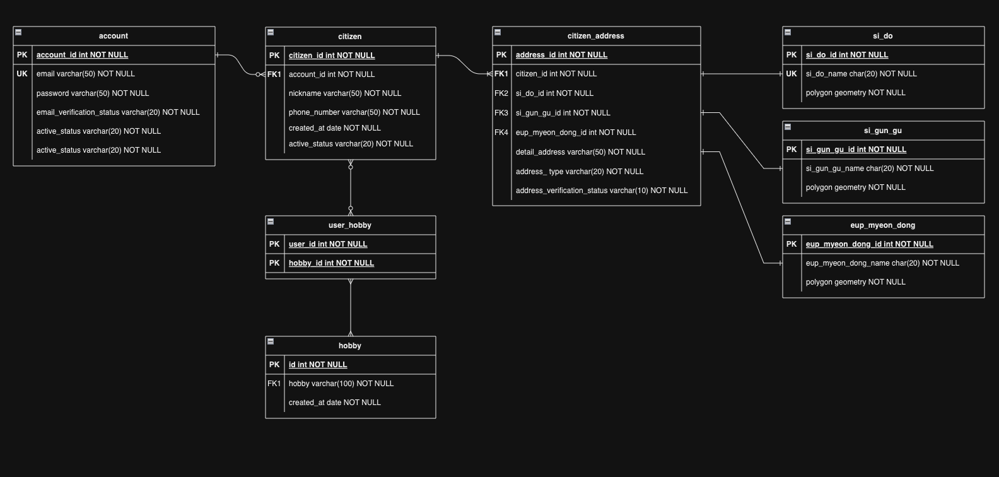

account 등록 후 citizen을 등록하려고 보니 관련된 테이블들이 너무 많습니다.

JPA에 익숙하지 않아서 조금 낯선 상황입니다. 🥲



---

# 고민점

1. citizen 등록
  - 등록전 address 조회가 선행 되어야만 합니다.
  - 근데 jpa에서 등록하려고 보니 citizen에 address entity가 필요하고 address엔 sido, sigungu, eupmyeondong entity가 필요합니다.


---

# 🔥 연관관계에 대해 공부하지 않고 Jpa를 구성 했을때

### Account

```java
@Entity
public class AccountEntity {
    @Id
    @GeneratedValue(strategy = jakarta.persistence.GenerationType.IDENTITY)
    private Long accountId;
    private String email;
    private String password;
    @Enumerated(EnumType.STRING)
    private AccountEmailVerificationStatus emailVerificationStatus;
    @Enumerated(EnumType.STRING)
    private AccountActiveStatus activeStatus;
    @OneToMany(mappedBy = "accountEntity")
    private List<CitizenEntity> citizens = new ArrayList<>();

    private String emailVerificationToken;

    public AccountEntity() {}

    public AccountEntity(String email, String password, AccountEmailVerificationStatus emailVerificationStatus, AccountActiveStatus activeStatus) {
        this.email = email;
        this.password = password;
        this.emailVerificationStatus = emailVerificationStatus;
        this.activeStatus = activeStatus;
    }

    public AccountEntity(Account account) {
        this.email = account.email();
        this.password = account.password();
        this.emailVerificationStatus = account.emailVerificationStatus();
        this.activeStatus = account.activeStatus();
        emailVerificationToken = account.emailVerificationToken();
    }

    public Account toDomain() {
        return new Account(this.accountId ,this.email, this.password, this.emailVerificationToken, this.emailVerificationStatus, this.activeStatus);
    }

    public void update(AccountUpdateRequest updateRequest) {
        this.email = updateRequest.email();
    }

    public void update(Account account) {
        this.email = account.email();
        this.password = account.password();
        this.emailVerificationStatus = account.emailVerificationStatus();
        this.activeStatus = account.activeStatus();
        emailVerificationToken = account.emailVerificationToken();
    }

    public void delete() {
        this.activeStatus = AccountActiveStatus.DELETED;
    }
}
```

### Citizen

```java
@Entity
public class CitizenEntity {

    @Id
    @GeneratedValue(strategy = jakarta.persistence.GenerationType.IDENTITY)
    private Long citizenId;
    private String nickname;
    private String phoneNumber;
    private LocalDate createdAt;
    private CitizenActiveStatus activeStatus;

    @ManyToOne(fetch = FetchType.LAZY)
    @JoinColumn(name="account_id")
    private AccountEntity accountEntity;

    @OneToMany(mappedBy = "addressEntity", cascade = CascadeType.ALL)
    private List<AddressEntity> addressEntity;

    @OneToOne(mappedBy = "hobbyEntity", cascade = CascadeType.ALL)
    private HobbyEntity hobbyEntity;

    public CitizenEntity(Citizen citizen) {
        this.nickname = citizen.nickname();
        this.createdAt = citizen.createdAt();
        this.phoneNumber = citizen.phoneNumber();
        this.activeStatus = CitizenActiveStatus.ACTIVE;
    }

    public CitizenEntity() {}

    public Citizen toDomain() {

        return null;
    }

    public void delete() {
        this.activeStatus = CitizenActiveStatus.DELETED;
    }
}
```

### Address

```java
@Entity
public class AddressEntity {
    @Id
    @GeneratedValue(strategy = jakarta.persistence.GenerationType.IDENTITY)
    private Long addressId;

    @OneToOne(fetch = FetchType.LAZY)
    @JoinColumn(name = "citizen_id")
    private CitizenEntity citizen;

    @OneToOne(fetch = FetchType.LAZY)
    @JoinColumn(name = "si_do_id")
    private SiDoEntity siDo;

    @OneToOne(fetch = FetchType.LAZY)
    @JoinColumn(name = "si_gun_gu_id")
    private SiGunGuEntity siGunGu;

    @OneToOne(fetch = FetchType.LAZY)
    @JoinColumn(name = "eup_myeon_dong_id")
    private EupMyeonDongEntity eupMyeonDong;

}
```

### Hobby

```java
@Entity
public class HobbyEntity {
    @Id
    private Long id;
    private String hobby;
    private LocalDate createdAt;

}
```

---

### 1. Citizen과 Account

- N : 1 의 양방향 관계
- Citizne이 주인
- Citizen이 fk로 Account의 pk를 가집니다.
- Citizen에 `@ManyToOne` , Account에는 `mappedBy`

### 2. Citizen과 Hobby

- N : M 의 관계 ( 1 : N, N : 1 )
- Citizen은 Hobby를 여러개 가질 수 있고 Hobby는 여러개의 Citizen에 속할 수 있다.
- Citizne이 주인
- 연관 테이블 생성
- Citizen

### 3. Citizen과 Address

- 1 : N 의 단방향 관계
- Citizen은 Address를 여러개 가지지만 Address는 Citizen에 대한 정보를 몰라도 됩니다.
- Citizen이 주인

# ✨ 고친 점

- Citizen과 Hobby의 다대다 관계 매핑
  - 관계 테이블을 따로 Entity로 만들어 나중에도 컬럼을 추가 할 수 있도록 변경
  - citizenId, hobbyId를 PK로 사용
  - `CitizenHobbyEntity` 의 목적은 관계 테이블의 이용이므로 따로 repository를 만들었습니다.

```java
@Entity
public class CitizenEntity {

    @Id
    @GeneratedValue(strategy = jakarta.persistence.GenerationType.IDENTITY)
    private Long citizenId;
    private String nickname;
    private String phoneNumber;
    private LocalDate createdAt;
    private CitizenActiveStatus activeStatus;

    @ManyToOne(fetch = FetchType.LAZY)
    @JoinColumn(name="account_id")
    private AccountEntity accountEntity;

    @OneToMany(mappedBy = "addressEntity", cascade = CascadeType.ALL)
    private List<AddressEntity> addressEntity;

    @OneToMany(mappedBy = "hobbyEntity", cascade = CascadeType.ALL)
    private List<HobbyEntity> hobbyEntity;

    public CitizenEntity(Citizen citizen) {
        this.nickname = citizen.nickname();
        this.createdAt = citizen.createdAt();
        this.phoneNumber = citizen.phoneNumber();
        this.activeStatus = CitizenActiveStatus.ACTIVE;
    }

    public CitizenEntity() {}

    public Citizen toDomain() {

        return null;
    }

    public void delete() {
        this.activeStatus = CitizenActiveStatus.DELETED;
    }
}
```

```java
@Getter
@Entity
@IdClass(CitizenHobbyId.class)
public class CitizenHobbyEntity {
    @Id
    @ManyToOne(fetch = FetchType.LAZY)
    @JoinColumn(name = "citizenId")
    private CitizenEntity citizen;

    @Id
    @ManyToOne(fetch = FetchType.LAZY)
    @JoinColumn(name = "hobbyId")
    private HobbyEntity hobby;
}
```

```java
public class CitizenHobbyId implements Serializable {
    private Long citizenId;
    private Long hobbyId;

    @Override
    public boolean equals(Object obj) {
        return super.equals(obj);
    }

    @Override
    public int hashCode() {
        return super.hashCode();
    }
}
```

```java
@Entity
public class HobbyEntity {
    @Id
    private Long hobbyId;
    private String hobby;
    private LocalDate createdAt;

}
```


------

# 시도, 시군구, 읍면동

예시) 1154510100 : 서울특별시 금천구 가산동

시도는 무조건 전체 조회

- /address/sido

시군구 조회

- /address/sigungu?sido=11

읍면동 조회

- /address/eupmyeondong?sido=11&sigungu=545

```java
@Repository
@RequiredArgsConstructor
public class AddressDao implements AddressRepository {
    private final AddressJpaRepository addressJpaRepository;
    private final SiDoJpaRepository siDoJpaRepository;
    private final SiGunGuJpaRepository siGunGuJpaRepository;
    private final EupMyeonDongJpaRepository eupMyeonDongJpaRepository;

    @Override
    public AddressResponse save(Address address) {
        AddressEntity addressEntity = addressJpaRepository.save();
        return addressEntity.toDomain();
        return null;
    }

    @Override
    public List<SiDo> getSiDoList() {
        List<SiDoEntity> all = siDoJpaRepository.findAll();
        return all.stream().map(SiDoEntity::toDomain).collect(Collectors.toList());
    }

    @Override
    public List<SiGunGu> getSiGunGuList(String sido) {
        List<SiGunGuEntity> all = siGunGuJpaRepository.findBySido(sido);
        return all.stream().map(SiGunGuEntity::toDomain).collect(Collectors.toList()));
    }

    @Override
    public List<EupMyeonDong> getEupMyeonDongList(String sido, String sigungu) {
        List<EupMyeonDongEntity> all = eupMyeonDongJpaRepository.findBySidoAndSigungu(sido, sigungu);
        return all.stream().map(EupMyeonDongEntity::toDomain).collect(Collectors.toList());
    }
}
```

위와 같이 만들고 보니 시군구에선 시도 코드를, 읍면동에선 시도, 시군구 코드를 가지고 있는게 조회시 편할 것 같다는 생각이 들었습니다.

이걸 JPA로 어떻게 풀어야 하는지가 고민입니다.


---

참고

[JPA 연관 관계 한방에 정리 (단방향/양방향, 연관 관계의 주인, 일대일, 다대일, 일대다, 다대다)](https://jeong-pro.tistory.com/231)

[](https://cs-ssupport.tistory.com/482)


