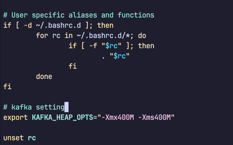
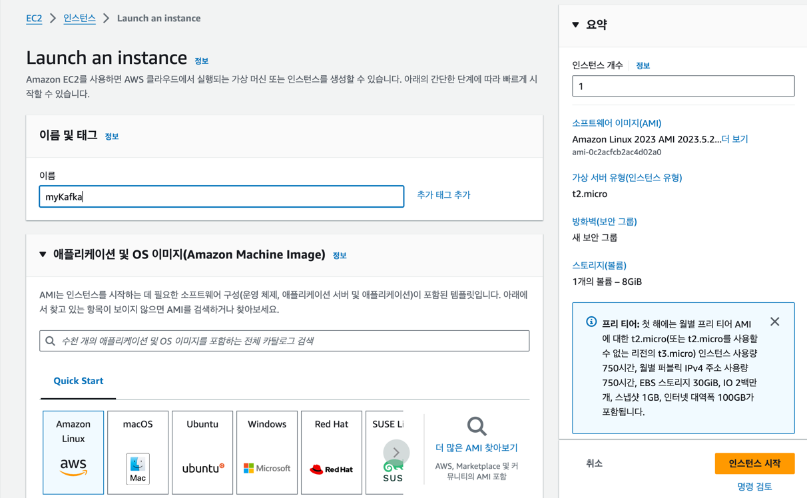

### AWS에서 카프카 구축하기

AWS에서 카프카를 구축할 수 있는 방법은 크게 두 가지 있습니다.

1. AWS MSK (Managed Streaming for Apache Kafka)
2. EC2에 카프카를 직접 설치

### EC2에 카프카 설치
1. 주키퍼와 카프카 브로커는 JVM 위에서 돌아가는 애플리케이션이므로 힙 메모리를 지정해야 합니다.
   * 두 프로세스에 각각 400MB 정도의 힙 메모리를 할당하려면 1G이상의 램이 필요하므 1GB메모리를 가진 t2.micro 인스턴스가 적합합니다.
2. 카프카 브로커의 기본 포트는 9092이고 주키퍼의 기본 포트는 2181입니다.
   * AWS EC2의 보안그룹의 Inbound 설정에 9092와 2181 포트를 열어주어야 합니다.
3. java install 해주셔야 합니다.
   * `sudo yum install -y java-1.8.0-amazon-corretto.x86_64` 저는 이 버전으로 깔았습니다.
4. kafka 압축 파일을 `wget`으로 다운 받고 압축 풉니다.
   * `https://archive.apache.org/dist/kafka/2.5.0/kafka_2.12-2.5.0.tgz`
5. 카프카 브로커를 실행하기 위한 힙 메모리 설정을 변경합니다.
   * `export KAFKA_HEAP_OPTS="-Xmx400M -Xms400M"`
   * 매번 터미널 열 때마다 해야하므로  `~/.bashrc`에 추가해줍니다.
6. advertised.listeners 설정을 변경합니다.
   * `config/server.properties` 파일을 열어서 `advertised.listeners=PLAINTEXT://<EC2의 퍼블릭 IP>:9092` 로 변경합니다.
   * advertised.listeners는 카프카 클라이언트 또는 커맨드 라인 툴을 브로커와 연결할 때 사용합니다.
   * 그 외 중요한 설정들은 책을 유심히 보시길~
7. kafka 서버를 실행합니다.
   * `/home/ec2-user/kafka_2.12-2.5.0/bin` 해당 경로에 sh파일이 있습니다.
   * `./kafka-server-start.sh -daemon /home/ec2-user/kafka_2.12-2.5.0/config/server.properties` 실행하면 카프카 브로커가 실행됩니다.
8. 주키퍼 실행
   * 분산 코디네이션 서비스를 제공해주는 주키퍼
     - 분산 코디네이션 : 
     - 1대만 실행하는 주키퍼를 `Quick-and-dirty` 라고 합니다. -> 즉, 비정상이라는 뜻입니다.
9. 카프카 실행
  * `bin/kafka-server-start.sh -daemon config/server.properties` 실행하면 카프카 브로커가 실행됩니다.
10. 로컬과 aws에서 기동한 카프카가 연결되는지 확인
  * `bin/kafka-broker-api-versions.sh --bootstrap-server <Public IP>:9092` 실행하면 연결이 잘 되는지 확인할 수 있습니다.

