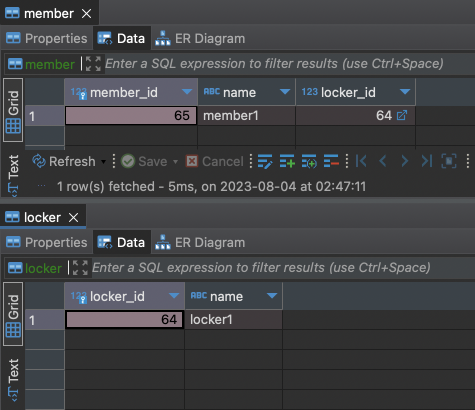
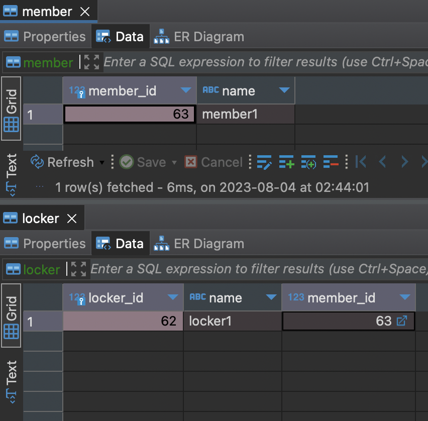

# 일대일

일대일은 양쪽 다 FK를 가질 수 있다. 고로 누가 FK를 관리할지 선택해야 합니다.

## 주인 테이블에 외래 키

주인 테이블에 외래 키가 있으면 편리하게 매핑할 수 있어 객체지향시 선호합니다.

### ➡️단방향

주인

```java
@Entity
public class Member {
    @Id
    @GeneratedValue
    @Column(name = "member_id")
    private Long id;

    private String name;

    @OneToOne
    @JoinColumn(name = "locker_id")
    private Locker locker;
}
```

대상

```java
@Entity
public class Locker {
    @Id @GeneratedValue
    @Column(name = "locker_id")
    private Long id;

    private String name;
}
```

```java
public class _1_Test {
    public static void main(String[] args) {
        EntityManagerFactory emf = Persistence.createEntityManagerFactory("myApp");
        EntityManager em = emf.createEntityManager();
        EntityTransaction tx = em.getTransaction();
        tx.begin();

        Locker locker = new Locker("locker1");
        Member member = new Member("member1", locker);

        em.persist(locker);
        em.persist(member);

        tx.commit();
        emf.close();
    }
}
```

```java
Hibernate: 
    select
        nextval ('hibernate_sequence')
Hibernate: 
    select
        nextval ('hibernate_sequence')
Hibernate: 
    insert 
    into
        Locker
        (name, locker_id) 
    values
        (?, ?)
Hibernate: 
    insert 
    into
        Member
        (locker_id, name, member_id) 
    values
        (?, ?, ?)
```

### ↔️양방향

주인

```java
@Entity
@NoArgsConstructor
public class Member {
    @Id
    @GeneratedValue
    @Column(name = "member_id")
    private Long id;

    private String name;

    @OneToOne
    @JoinColumn(name = "locker_id")
    private Locker locker;

		//getter&setter

		//연관관계 편의 메소드
    public void setLocker(Locker locker) {
        if (this.locker != null) {
            this.locker.setMember(null);
        }
        this.locker = locker;
        if(locker != null) {
            locker.setMember(this);
        }
    }
}
```

대상

```java
@Entity
@NoArgsConstructor
public class Locker {
    @Id @GeneratedValue
    @Column(name = "locker_id")
    private Long id;

    private String name;

    @OneToOne(mappedBy = "locker")
    private Member member;

		//getter&setter

    public void setMember(Member member) {
        this.member = member;
    }
}
```

```java
Hibernate: 
    select
        nextval ('hibernate_sequence')
Hibernate: 
    select
        nextval ('hibernate_sequence')
Hibernate: 
    insert 
    into
        Locker
        (name, locker_id) 
    values
        (?, ?)
Hibernate: 
    insert 
    into
        Member
        (locker_id, name, member_id) 
    values
        (?, ?, ?)
```



## 대상 테이블에 외래 키

### ➡️단방향

존재하지 않습니다.

### ↔️양방향

대상

```java
@Entity
@NoArgsConstructor
public class Member {
    @Id
    @GeneratedValue
    @Column(name = "member_id")
    private Long id;
    private String name;
    @OneToOne(mappedBy = "member")
    private Locker locker;

		//getter&setter

    public void setLocker(Locker locker) {
        this.locker = locker;
    }
}
```

대상

```java
@Entity
@NoArgsConstructor
public class Member {
    @Id
    @GeneratedValue
    @Column(name = "member_id")
    private Long id;
    private String name;
    @OneToOne(mappedBy = "member")
    private Locker locker;

		//getter&setter

    public void setLocker(Locker locker) {
        this.locker = locker;
    }
}
```

주인

```java
@Entity
@NoArgsConstructor
public class Locker {
    @Id @GeneratedValue
    @Column(name = "locker_id")
    private Long id;
    private String name;

    @OneToOne
    @JoinColumn(name = "member_id")
    private Member member;

    //getter&setter

    public void setMember(Member member) {
        if(this.member != null){
            this.member.setLocker(null);
        }
        this.member = member;
        if(member.getLocker() != this){
            member.setLocker(this);
        }
    }
}
```

```java
Hibernate: 
    select
        nextval ('hibernate_sequence')
Hibernate: 
    select
        nextval ('hibernate_sequence')
Hibernate: 
    insert 
    into
        Locker
        (member_id, name, locker_id) 
    values
        (?, ?, ?)
Hibernate: 
    insert 
    into
        Member
        (name, member_id) 
    values
        (?, ?)
Hibernate: 
    update
        Locker 
    set
        member_id=?,
        name=? 
    where
        locker_id=?
```

